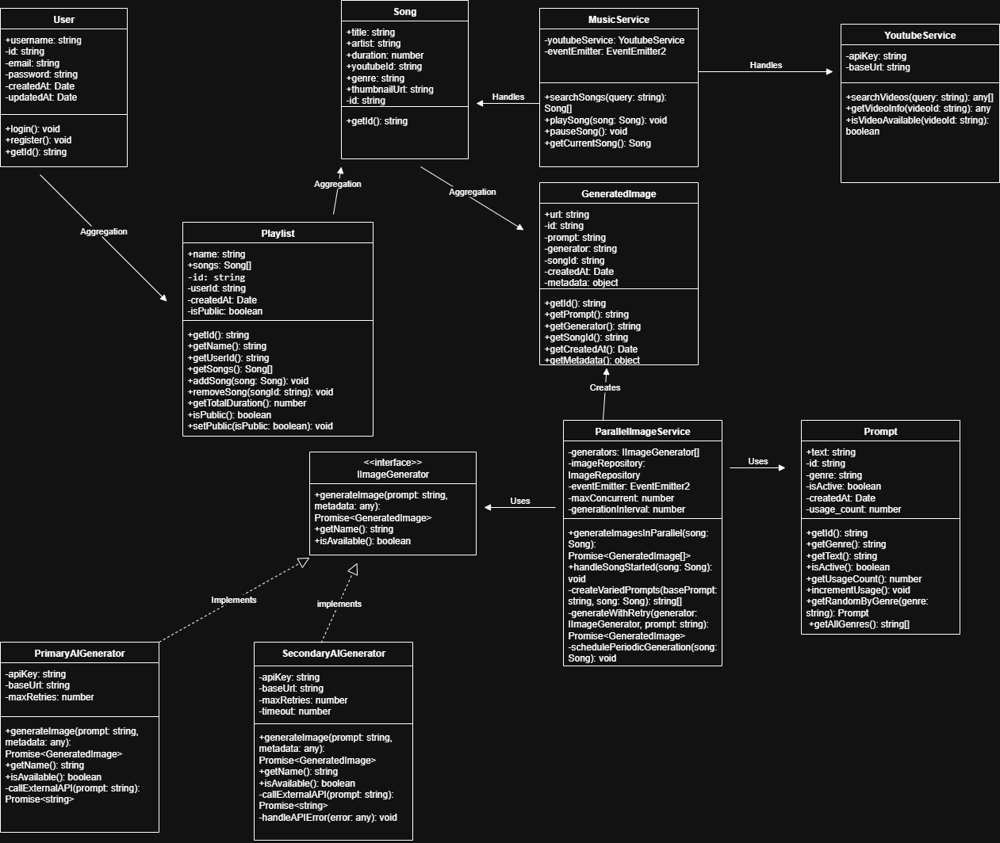

# 🎵 VIBRA – Backend

## 📋 Resumen
VIBRA es un reproductor de música que genera imágenes en tiempo real usando IA basadas en las canciones reproducidas.  
El backend está construido con **NestJS + TypeScript**, y se conecta a **PostgreSQL** (datos estructurados) y **MongoDB** (imágenes generadas).  
Se integra con **YouTube API** y servicios de IA (DALL·E, DeepAI, etc.).

---

## 🏗️ Arquitectura
- **Autenticación** (`auth/`)
- **Música**: búsqueda y reproducción vía YouTube (`music/`)
- **Imágenes**: generación con IA y prompts (`images/`)
- **Playlists**: gestión de listas de reproducción (`playlists/`)
- **Usuarios**: gestión de perfiles (`users/`)
- **Shared**: constantes, utils y base de datos (`shared/`)

---

## 📐 Diagrama de Clases

---

## 🚀 Flujo Principal
1. El usuario reproduce una canción.
2. `MusicService` emite un evento `song.started`.
3. `ImageService` responde generando imágenes con múltiples IAs en paralelo.
4. Las imágenes se almacenan en **MongoDB**.
5. El frontend recibe las imágenes en tiempo real.

---

## ✨ Características
- ⚡ **Tiempo real**: imágenes dinámicas mientras suena la música  
- 🧩 **Arquitectura modular**: cada módulo independiente  
- 🤖 **Soporte multi-IA**: DALL·E, DeepAI, extensible a más  
- 🗄️ **Persistencia híbrida**: PostgreSQL + MongoDB  
- 🛠️ **Mantenible y testeable**: repositorios y servicios mockeables  

---

## 👥 Autores
- Sergio Peckerle  
- Diego Ortino  
- Cristian Calvo  
- Sebastián Allende  

